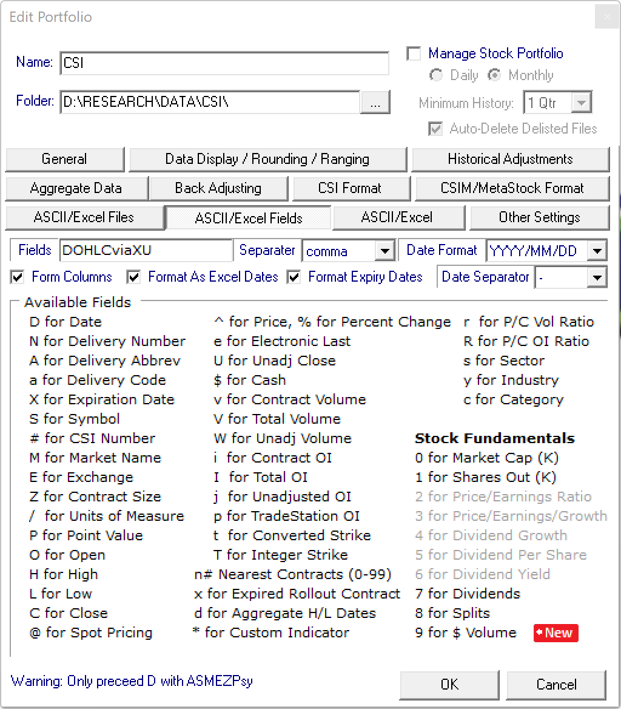

```{r setup, include=FALSE,message=F,warning=F}
knitr::opts_chunk$set(echo = TRUE)
library(tidyverse)
library(lubridate)
library(data.table)
library(roll)
library(readxl)
library(pbapply)
library(knitr)
library(kableExtra)
```

## Introduction

## Configuring CSI data

CSI data is a great supplier of Futures data, but the user interface seems stuck in the 90's. There is a lot of configuration required for the data to be presented in the way we need. Make sure you examine the portfolio window carefully and go through each section. Below are my settings for file naming and file data.

"){width="600"}

{width="600"}

## Examining the data

```{r Get List of Futures Files, echo=T}

#### Get Futures Data ####
#List files
csvFolder='D:/RESEARCH/DATA/CSI'
meta=readxl::read_xlsx('D:/Trading/AUTO/ASSETS.xlsx')


rgx=paste0("(",paste(meta$symbol[meta$group=='futures'],collapse="|"),")");rgx
files.all=list.files(csvFolder,pattern=rgx,recursive = T,ignore.case = T,full.names = T)
files.backadjusted=list.files(csvFolder,pattern=paste0(rgx,'\\_B.CSV'),recursive = T,ignore.case = T,full.names = T)
files.fut=setdiff(files.all,files.backadjusted)


rgx=paste0("(",paste(meta$symbol[meta$group=='FX'],collapse="|"),")")
rgx=gsub('}','\\}',gsub('{','\\{',rgx,fixed=T),fixed=T);rgx
files.fx=list.files(csvFolder,pattern=rgx, recursive=T,ignore.case=T,full.names=T)


```


The data for this example market looks OK. Let's get all the data!

```{r Get ALL the data,echo=T}

#Read files
symbols=gsub('_','',substr(basename(files.fut),1,3))
types=if_else(substr(basename(files.fut),6,6)=='$','spot','fut')
CSI=bind_rows(pblapply(1:length(files.fut),function(i){ 
  fread(files.fut[i])%>%
    mutate(ExpiryDate=as_date(ExpiryDate))%>%
    mutate(Date=as_date(Date))%>%
    mutate(Symbol=symbols[i])%>%
    mutate(Type=types[i])%>%
    mutate(Delivery=if_else(Type=='spot','spot',Delivery))
}))
names(CSI)=tolower(names(CSI))
CSI=data.frame(CSI)

symbols=gsub('_','',substr(basename(files.fx),1,3))

FX=bind_rows(pblapply(1:length(files.fx),function(i){
    fread(files.fut[i])%>%
    mutate(Date=as_date(Date))%>%
    mutate(Symbol=symbols[i])
} ))%>%select(Date,Open,High,Low,Close,Symbol)
names(FX)=tolower(names(FX))
```

OK we have a lot of data: `r nrow(FUT)` rows.

### Processing individual contract data

```{r Processing Individual Contract Data,echo=T}

#Back-Adjust
FUT=CSI%>%
  inner_join(meta,by='symbol')%>%
  #### Data clean up. If open interest for all contracts for a given date is 0, then set as NA and back fill ####
  group_by(date,symbol)%>%
    mutate(totaloi=sum(oi))%>%
    mutate(oi=ifelse(totaloi==0,NA,oi))%>%
  group_by(symbol,delivery)%>%
    arrange(date)%>%
    fill(oi)%>%
  ungroup()%>%
  mutate(expirydate=if_else(type=='spot',as_date(NA),expirydate))%>%
  group_by(date,symbol)%>%
    mutate(dte=as.double(difftime(expirydate,date,units='days')))%>%
  ungroup()%>%
  ###Back-Adjusting routine
  group_by(symbol,delivery)%>%
    arrange(date)%>%
    mutate(
      lagOI=lag(oi),
      lagExpiry=lag(expirydate),
      lag2OI=lag(oi,2),
      lag2Expiry=lag(expirydate,2),
      delta=close-lag(close),
      c2c=close/lag(close)-1,
      c2o=open/lag(close)-1,
      o2c=close/open-1,
      #fxret=fx/lag(fx)-1,
      logret=log(close/lag(close)),
      c2c.p=close-lag(close),
      c2o.p=open-lag(close),
      o2c.p=close-open
      )%>%
    mutate(vola=100*16*roll_sd(logret,30))%>%
  ungroup()


```


## Computing Carry

```{r Calculating Carry, echo=T}

ref_days=100
CARRY.100D=FUT%>%
  #filter(type=='spot' | (type=='fut' & oi>0))%>%
  mutate(refdays=ref_days)%>%
  group_by(symbol,date)%>%
    mutate(rank.above=row_number(ifelse(dte-refdays<0,NA,dte-refdays)) )%>%
    mutate(rank.below=row_number(ifelse(refdays-dte<=0,NA,refdays-dte)) )%>%
    filter(type=='spot' | rank.above==1 | rank.below==1 )%>%
    arrange(expirydate)%>%
    mutate(C=paste0(row_number()))%>%
  ungroup()%>%
  select(symbol,name,date,C,close,dte,expirydate,oi,refdays)%>%
  pivot_wider(names_from = C,values_from=c(dte,close,expirydate,oi))%>%
  select(-c(dte_3,expirydate_3))%>%
  na.omit()%>%
  arrange(symbol,date)%>%
  mutate(close_s=(close_2-close_1)/(dte_2-dte_1)*(refdays-dte_1)+close_1)%>%
  #Compute carry as expected return
  mutate(carry=100*roll_median(365/refdays*(close_3-close_s)/roll_sd(close_s,30)/sqrt(252),5))%>%
  mutate(spread=close_1-close_2)

CARRY.100D%>%distinct(symbol)
bind_rows(CARRY.100D)%>%filter(date>'2000-12-01')%>%filter(symbol=='S2')%>%ggplot(aes(x=date,y=carry))+geom_step(size=1)+ggtitle('Soybeans',subtitle = 'Carry expected return')+theme_bw()

```

## Constructing Continuous Contracts

```{r Constructing Continuous Contracts, echo=T}

#Next contract
FUT.NEXT=FUT%>%
  group_by(date,symbol)%>%
    filter(oi==max(oi))%>%
    filter( n()==1 | (n()>1 & expirydate==max(expirydate)))%>%
  ungroup()%>%
  select(date,symbol,nextdelivery=delivery,nextOI=oi)

#Previous contract
FUT.PREV=FUT%>%
  group_by(date,symbol)%>%
    #Pick the contract with the highest OI or
  filter(lag2OI==max(lag2OI))%>%
  filter( n()==1 | (n()>1 & lag2Expiry==max(lag2Expiry)))%>%
  ungroup()%>%
  select(date,symbol,prevdelivery=delivery,prevOI=oi,prevC2O=c2o)

FUT.BA=FUT%>%
  group_by(date,symbol)%>%
    #Pick the contract with the highest OI or
    filter(lagOI==max(lagOI))%>%
    filter( n()==1 | (n()>1 & lagExpiry==max(lagExpiry)))%>%
  ungroup()%>%
  inner_join(FUT.NEXT,by=c('date'='date','symbol'='symbol'))%>%
  inner_join(FUT.PREV,by=c('date'='date','symbol'='symbol'))%>%
  group_by(symbol)%>%
    arrange(date)%>%
    mutate(ret=case_when(
      delivery!=prevdelivery ~ (1+prevC2O)*(1+o2c)-1, #ROLL OVER MARKET ON OPEN
      TRUE ~ c2c
    ))%>%
    mutate(vami=cumprod(1+ret))%>% 
  ungroup()%>%
  mutate(type='FUT')

```

```{r QC}
FUT.BA%>%
  filter(symbol=='CL2')%>%
  ggplot(aes(x=date,y=vami,color=symbol))+theme_bw()+geom_step(size=1)
```
